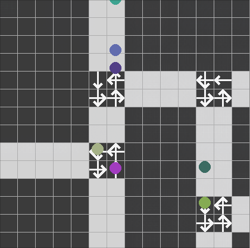

> [!WARNING]
> Highly beta, PRs are welcome.

## Microtraffic simulation


## Get started
### Setup python execution environment
```
git clone https://github.com/Naakinn/MicroTraffic && cd MicroTraffic
python3 -m venv venv
source venv/bin/activate
pip install -r requirements.txt
```
### Build your own map with MapBuilder
```
python map_builder.py
```
It wil generate `surfarray.pickle` and `grid.pickle` in your current directory. 

### Run the simulation using generated map
Run
```
python simulation.py
```
in the same directory to use saved map in your simulation. 

### Check out simulation's state at web page
Run
```
python api/api.py
```
and check out localhost:8000/api/traffic/info
## Docs
### MapBuilder
Scroll your mouse wheel to select different blocks:
- white block - road
- arrows - intersections(arrow specify where a vehicle have to turn)

Left click - place selected block
Right click - remove block 
### Simulation
Scroll your mouse wheel to spawn vehicles with different directions

